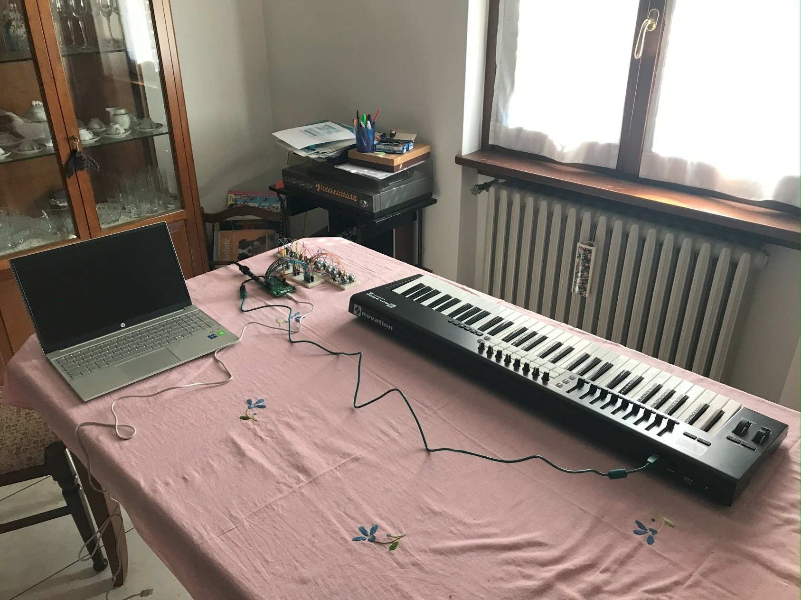
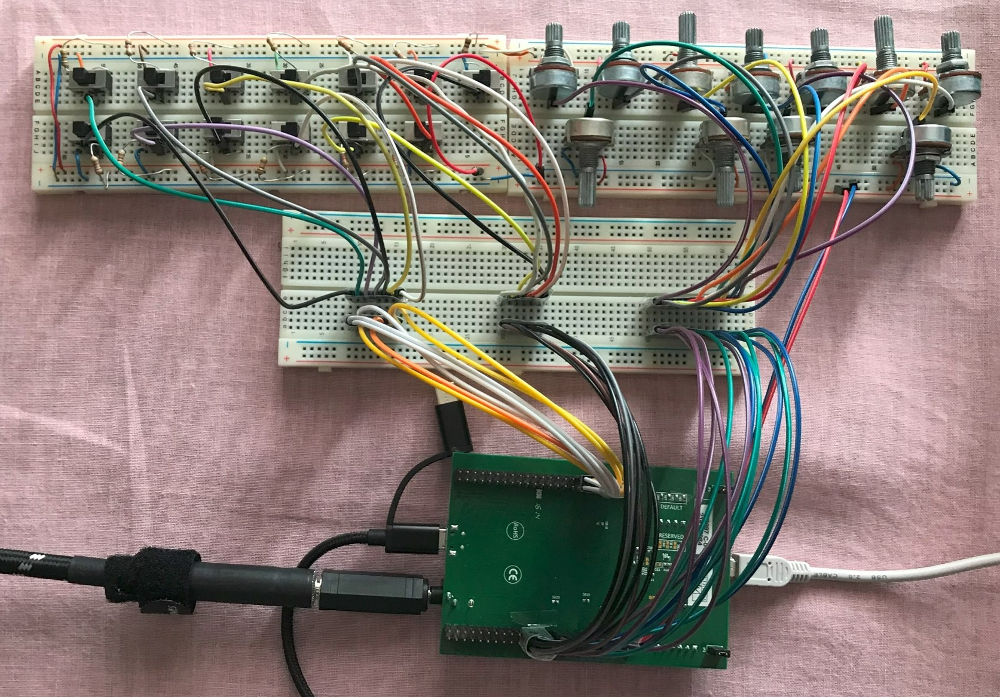
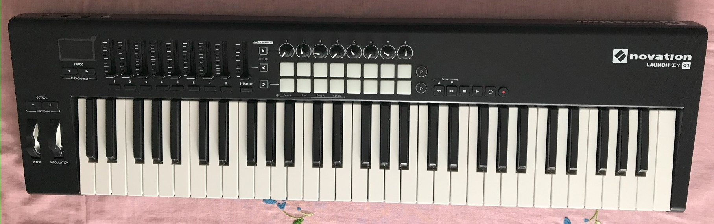

# MikroMood
MikroMood: a simple and tiny emulation of the famous MiniMoog developed on STM32F4  
Embedded Systems & Sensor Systems Design project @Unimi

See the MikroMooD_Report.pdf and  Presentation.pdf files for more info!

In the directory: "Media/Video/" you can find a pptx files containing the video of the testing.  
!!!Disclaimer!!! In the videos there is some noise added to the audio source due to a typo in the code i've discovered later after all the video recordings. Now the application works correctly and the new video testing will be updated as soon as possible.

##Hardware Project Setup

